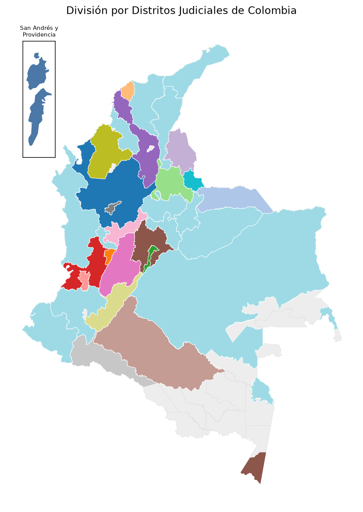
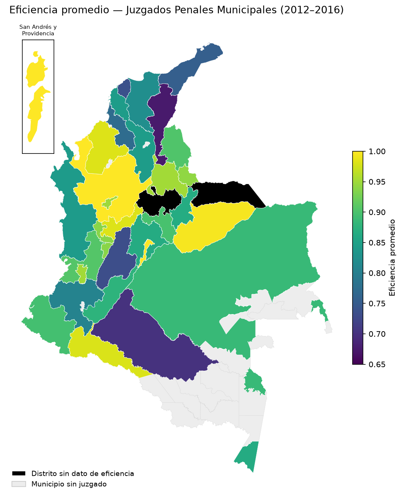
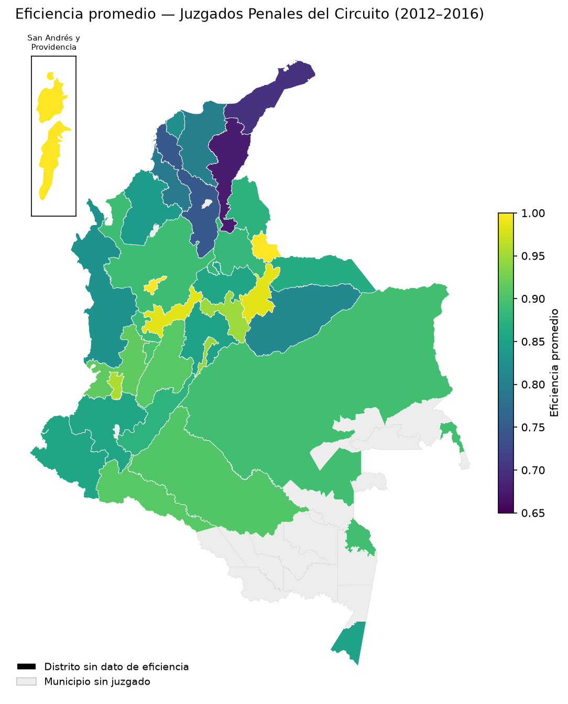

<div align="center">

# 🗺️ Mapa Judicial de Colombia

**La geografía judicial de Colombia, reconstruida desde el PDF oficial y lista para usar.**

_Mi primer proyecto después de aprender a programar, hoy reconstruido como un pipeline que, con un
comando, convierte el Mapa Judicial en archivos de mapa (GeoJSON, TopoJSON, Excel). Lo que quiero
mostrar acá es el **método**: cómo abordo un problema de datos real de punta a punta._


<br>



</div>

---

Soy investigador en **análisis económico del derecho (Law & Economics)**. Para estudiar la justicia
colombiana en el espacio necesitaba algo que no existía como archivo geográfico: el mapa de los
**distritos judiciales**. Vive en un PDF. Así que lo reconstruí — a tres niveles
(**municipio → circuito → distrito**) y listo para Power BI, Dash o cualquier SIG.

---

## 🧩 El problema

> **La geografía judicial de Colombia no coincide con la división político-administrativa.**

Los distritos y circuitos judiciales cruzan fronteras departamentales y agrupan municipios a su manera.
No hay un archivo geográfico de esto: está en un PDF. Para analizarlo hay que **reconstruir esa
geografía** y cruzarla con los municipios oficiales del DANE, sin equivocarse en qué municipio es cuál.

---

## 🧠 Cómo lo resolví

El valor está en el método:

1. **Definí el producto primero.** El entregable son archivos de mapa multinivel importables, no un notebook.
2. **Extraje la jerarquía del PDF** con `camelot`: Distrito → Circuito → Municipio (~1.100 municipios).
3. **Homologué por código, no con 400 regex.** Los nombres del PDF no coinciden con los del DANE (tildes,
   abreviaturas, typos). En vez de corregirlos a mano, **construyo el código DANE** cruzando nombre
   normalizado + reglas + la zona del distrito, y dejo una tabla chica de *override* para el resto.
   **Cobertura: 1.104 de 1.104.**
4. **Verifiqué en serio.** Cacé casos donde un nombre matcheaba al municipio equivocado (`SANTUARIO` →
   El Santuario de Antioquia, no el de Risaralda) y separé *"distrito sin dato"* de *"municipio sin juzgado"*.
5. **Pegué la geometría oficial** del DANE/MGN por código y agregué (`dissolve`) por unidad **judicial**.
6. **Elegí la herramienta correcta.** Cuando Plotly no renderizaba las áreas de la Amazonía, lo diagnostiqué
   y pasé a matplotlib.
7. **Dejé trazado el porqué** en la bitácora de decisiones ([`docs/bitacora-decisiones.md`](docs/bitacora-decisiones.md), `D-001`…`D-007`).

> Trabajé esto con un agente de IA (**Claude Code**): yo dirijo — defino el problema, aporto los insights
> (como el de los códigos) y decido; el agente ejecuta y deja todo trazado.

---

## 👀 Un vistazo

<div align="center">

| Eficiencia — Juzgados Municipales | Eficiencia — Juzgados de Circuito |
|:---:|:---:|
|  |  |

_Negro = distrito sin dato · Gris = municipio sin juzgado · inset: San Andrés y Providencia._

</div>

---

## ▶️ Cómo correr

Todo corre **dentro de un Dev Container**: no instalás Python ni nada en tu máquina, vive en el contenedor.

**Requisitos:** [Docker](https://www.docker.com/) (en Windows, vía WSL2), [VS Code](https://code.visualstudio.com/)
con la extensión [Dev Containers](https://marketplace.visualstudio.com/items?itemName=ms-vscode-remote.remote-containers), y Git.

**Paso a paso:**

```bash
# 1. Clonar el repo y entrar a la carpeta
git clone https://github.com/ClearNote97/Colombian-Judicial-Distircts-Choropleth-Map.git
cd Colombian-Judicial-Distircts-Choropleth-Map

# 2. Abrir en VS Code
code .
```

3. **Abrir en el contenedor:** `Ctrl+Shift+P` → **"Dev Containers: Reopen in Container"**. Esperá a que
   termine (la primera vez construye la imagen y corre `uv sync`; tarda un poco).

4. **Generar el mapa** — un solo comando, en la terminal del contenedor:

```bash
uv run python -m judicial_map
#    → deja los archivos en output/
```

**Opciones:**

```bash
uv run python -m judicial_map --niveles distrito            # solo un nivel (municipio|circuito|distrito)
uv run python -m judicial_map --niveles municipio circuito  # varios niveles
uv run python -m judicial_map --no-viz                      # solo los archivos de datos (sin PNG/PDF)
uv run python -m judicial_map --tolerance 0                 # geometría a máximo detalle (archivos pesados)
uv run python -m judicial_map --refresh                     # re-descargar las fuentes (solo si se actualizaron)
```

| Opción | Qué hace |
|---|---|
| `--niveles` | Qué nivel(es) generar (por defecto los tres). |
| `--tolerance` | Suavizado de bordes para aligerar archivos (default `0.001`; `0` = máximo detalle). |
| `--no-viz` | No generar los mapas de ejemplo PNG/PDF. |
| `--refresh` | Ignorar la caché y re-descargar las fuentes. |

Tests: `uv run pytest tests/`.

---

## 📦 Qué produce (en [`output/`](./output/))

Por cada nivel judicial, en tres formatos:

- **`.geojson`** — geometría, para Dash / web / SIG.
- **`.topojson`** — para el **Shape Map de Power BI** (compacto, bordes compartidos). Clave de enlace:
  `cod_dane` (municipio) o `district` (distrito/circuito).
- **`.xlsx`** — atributos sin geometría, para tablas y joins.

Más **mapas de ejemplo** (PNG + PDF, matplotlib) que colorean los distritos por la eficiencia de sus
juzgados, usando los datos de ejemplo (`data/other/DB1/DB2 *.xlsx`).

---

## 📄 Ejemplo de la salida

**Atributos a nivel municipio** (`mapa_judicial_municipio.xlsx` — y propiedades del geojson/topojson):

| district | circuit | municipality | cod_dane | municipio_dane |
|---|---|---|---|---|
| ANTIOQUIA | ABEJORRAL | ABEJORRAL | `05002` | ABEJORRAL |
| ANTIOQUIA | AMAGA | AMAGA | `05030` | AMAGÁ |
| ANTIOQUIA | AMALFI | AMALFI | `05031` | AMALFI |
| ANTIOQUIA | AMALFI | ANORI | `05040` | ANORÍ |
| ANTIOQUIA | ANDES | ANDES | `05034` | ANDES |

**A nivel distrito** (`mapa_judicial_distrito.xlsx`) — una fila por distrito con su conteo de municipios:

| district | n_municipios |
|---|---|
| ANTIOQUIA | 112 |
| ARAUCA | 8 |
| ARCH SAN ANDRES | 2 |
| ARMENIA | 12 |
| … | … |

**GeoJSON** — cada región es una *feature* con sus atributos + geometría (EPSG:4326):

```json
{
  "type": "Feature",
  "properties": { "district": "ANTIOQUIA", "n_municipios": 112 },
  "geometry": { "type": "Polygon", "coordinates": [[[-75.90, 6.41], [-75.88, 6.40], "..."]] }
}
```

> `cod_dane` es la **clave de enlace** para Power BI (texto de 5 dígitos, con el cero inicial: `05002`).

---

## 🔗 Fuentes de datos

Acceso directo a las fuentes oficiales que usa el pipeline:

| Fuente | Qué aporta | Acceso directo |
|---|---|---|
| **Mapa Judicial** (Rama Judicial) | Jerarquía distrito → circuito → municipio | [📄 PDF](https://www.ramajudicial.gov.co/documents/10228/64622/MAPA+JUDICIAL%282%29.pdf/cab3506e-a815-4fac-bb08-288b7ad54d69) |
| **DIVIPOLA** (DANE) | Código DANE de 5 dígitos por municipio | [📊 XLSX](https://geoportal.dane.gov.co/descargas/divipola/DIVIPOLA_Municipios.xlsx) |
| **MGN 2024** (DANE) | Geometría municipal con código DANE | [🌐 FeatureServer](https://geoportal.dane.gov.co/mparcgis/rest/services/MMRA2024/Serv_CapasMMRA_2024/FeatureServer/317) · [geoportal](https://geoportal.dane.gov.co/) |

En la primera corrida el pipeline descarga estas tres y las deja en caché (`data/other/cache/`); después
trabaja offline. Los `.xlsx` de eficiencia (`DB1`/`DB2`) son **datos de ejemplo** para verificar, no el producto.

---

## 🔬 Hallazgos

Del cruce Mapa Judicial × DANE (detalle en [`docs/hallazgos-geograficos.md`](docs/hallazgos-geograficos.md)):

- **12 municipios** cuyo distrito judicial está en **otro departamento** — y el propio PDF los marca con sufijos `(BOY)`, `(CESAR)`, `(CUND)`…
- El distrito de **Villavicencio abarca 6 departamentos** (Meta, Vichada, Guainía, Guaviare, Vaupés y parte de Cundinamarca).
- **20 municipios sin juzgado asignado** (16 son áreas no municipalizadas de la Amazonía): los vacíos del mapa.

---

## 🗂️ Estructura

```
.
├── src/judicial_map/    # pipeline: ingest → homologate → merge → export (+ viz) · __main__
├── data/
│   ├── other/           # datos de ejemplo + caché de fuentes
│   └── homologacion/    # tabla de override municipio → código DANE (YAML)
├── output/              # el producto (geojson/topojson/xlsx) + mapas de ejemplo (png/pdf)
├── tests/               # pytest
├── docs/
│   ├── bitacora-decisiones.md    # el PORQUÉ de cada decisión (D-001…D-007)
│   ├── hallazgos-geograficos.md  # los hallazgos de investigación
│   ├── diccionario-de-datos.md   # qué significa cada variable
│   └── legado/                   # el notebook original, intacto
├── .devcontainer/       # definición del entorno (Dev Container + uv)
├── AGENTS.md            # contrato de trabajo con el agente de IA
└── README.md            # este archivo
```

---

## 🛠️ Stack

- **Python 3.14** con **`uv`** (lockfile reproducible) · **Dev Container + Docker** (VS Code).
- **camelot** (tablas del PDF) · **geopandas / shapely / pyproj / pyogrio** · **topojson** ·
  **pandas / numpy** · **openpyxl** · **matplotlib**.
- **Plantilla base:** [ClearNote Py DA](https://github.com/ClearNote97/ClearNote_Py_DA) — mi plantilla de dev container para análisis de datos en Python.

---

## 🙏 Créditos

- **Autor:** MSc. Nicolás Enrique Valencia Santiago.
- **Par de trabajo:** agente de IA (Claude / Claude Code, en el marco [Helix](https://github.com/ftuga/helix_asisten) de [ftuga](https://github.com/ftuga)).
- **Datos:** [Rama Judicial de Colombia](https://www.ramajudicial.gov.co/) y [DANE](https://geoportal.dane.gov.co/) (DIVIPOLA, MGN).

## ⚖️ Licencia

[MIT](https://opensource.org/license/MIT).
